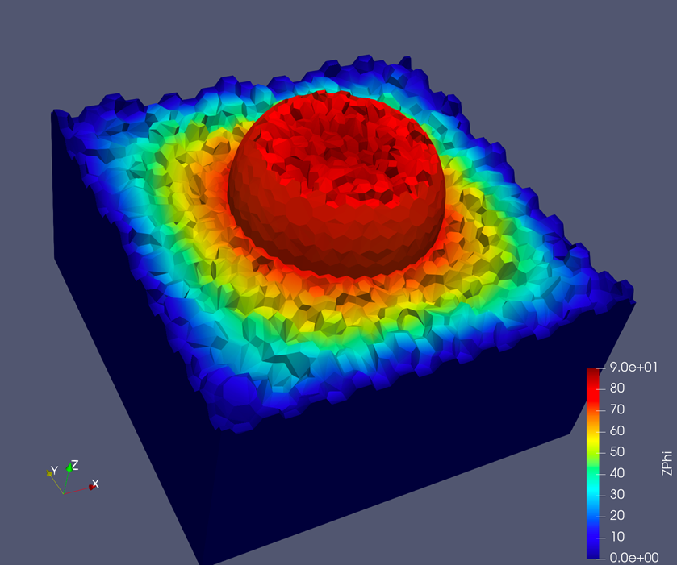
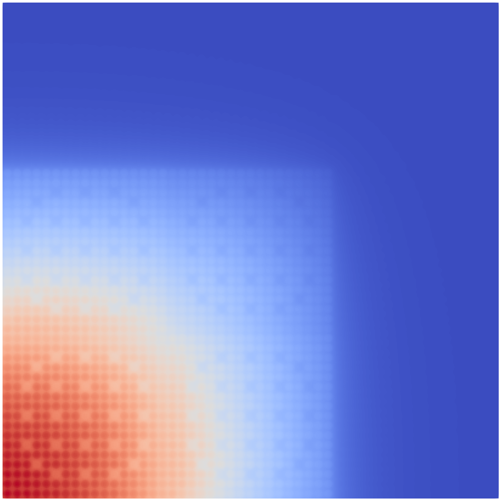

# Gallery

## 1. Capable of sweeps on Polyhedral meshes
Sphere embedded within a box:
- Concave cells induce cyclic dependencies between cells.
- Non-cutting Volumetric partitioning induces cyclic dependencies
  between processors.
- Data structures allows for sweeping will all forms of cycles.

3D Polyhedral mesh generated with STAR-CCM+.

Slice of the solution.

Arbitrary, non-cutting, KBA-style partitioning used.

## 2. C5G7 Criticality Benchmark with 768 processors
Very old results (circa 2020) for the reactor benchmark C5G7.
- these results did not use acceleration techniques
- **To be updated in Spring 2024**

- 7 energy groups
- 200 directions
- 454,491 cells
- Ran on 768 processors
- Took only 18 minutes to complete (**less than 2 min today**)
- Used 584 GB of memory
- `k_eff` within 100 pcm (**much less today**)

Closeup view of the mesh used. Colors represent materials.

Energy group 0 solution.

Energy group 6 solution.

ParMETIS partitioning of the mesh (768 processors).

Closeup of the ParMETIS partitioning with the mesh visible.

## 2. Real world simulations
Center for Exascale Radiation Transport (CERT) simulated, and
compared to experiment, a graphite pile with a high energy neutron
source. This simulation used:
- ~172 energy groups. 
- over 3000 directions. 
- ~500k cells.
- Over 100k processors for some simulations.

